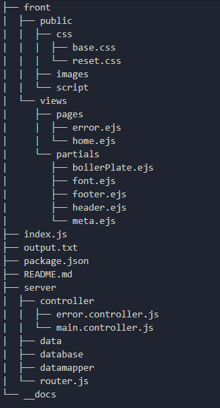

# Folder Structure for Node.js

## Introduction

Welcome here ! 🎡

This is my version of a folder structure when I work on my Node.js project. 

Have you ever wondering how you can have a starter folder structure just to fill out and start your project fastly ? I did and here I am.

You'll find in this repository a way to create the whole folder structure with a script bash to enter in your console.

I hope that my instructions will be clear, contact me if not.

I'm open for all suggestions and improvement ! 😃

Thank you for reading and let's go !

## How to start ?

So, it's a folder structure for Node.js, but you don't need to know Node to doing this (even if I hope you know how to use it, that's the reason you're here now right ? haha) 

You'll find below the structure : 




## What do I have to do ?

Firstable, clone the repository.

The script will init [NPM](https://www.npmjs.com/) and install [Node](https://nodejs.org/en/) dependencies, it will open [VScode](https://code.visualstudio.com/) so if you don't have VSC, open "files-node.sh" and remove "code ." at the end of the file.

Open a console in the file (I personally use Git Bash)


Write in the console :

```js
chmod +x files-node.sh
```

And 

```js
source files-node.sh
```

These commands will create a folder named "project".


**Be careful of the path of your file !** If you want to create the folder in another folder, you have to modify the path. For example if you have the files-node.sh IN a folder on you desktop and you want to create new "project" on Desktop, the path is :

```js
chmod +x ./node-folder-structure/files-node.sh
```

And 

```js
source ./node-folder-structure/files-node.sh
```

## Copy files

The 2nd script was created in the aim to copy my project folder  where I've already embed my router, error page, my database etc... 

In my case, with the **"files-node.sh"** I've created my **"project"** folder, I opened it and embed what I call my "starting code"

And everytime I want to start fastly a new project, I just copy my "starting project code" where I've already embed port, requiered modules and stuff I use.

So, to copy the project folder, same as **"files-node.sh"**, the commands are : 

```js
chmod +x copy-complete.sh
```

And 

```js
source copy-complete.sh
```

And that's it, you get your Node.js folder structure ! 

Feel free to tell me if it works for you !


